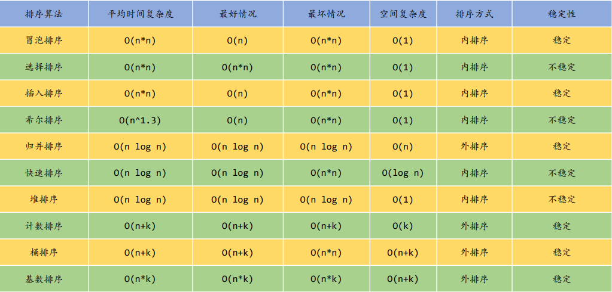

## 一、算法与设计模式专栏

### 1.查找与排序/KMP算法，栈/队列



#### 1.1 希尔排序

- 希尔排序，也称递减增量排序算法，是插入排序的一种更高效的改进版本。但希尔排序是非稳定排序算法。

  希尔排序是基于插入排序的以下两点性质而提出改进方法的：

  - 插入排序在对几乎已经排好序的数据操作时，效率高，即可以达到线性排序的效率；
  - 但插入排序一般来说是低效的，因为插入排序每次只能将数据移动一位；

  希尔排序的基本思想是：先将整个待排序的记录序列分割成为若干子序列分别进行直接插入排序，待整个序列中的记录"基本有序"时，再对全体记录进行依次直接插入排序。

- 算法步骤
  - 选择一个增量序列 t1，t2，……，tk，其中 ti > tj, tk = 1；
  - 按增量序列个数 k，对序列进行 k 趟排序；
  - 每趟排序，根据对应的增量 ti，将待排序列分割成若干长度为 m 的子序列，分别对各子表进行直接插入排序。仅增量因子为 1 时，整个序列作为一个表来处理，表长度即为整个序列的长度。

- [代码](./code/sort/sort.c)

  ```C
  int shell_sort(int *data, int length)
  {
      int gap = 0;
      int i = 0, j = 0;
      int temp = 0;
  
      // 外层分组
      for (gap = length / 2; gap >= 1; gap /= 2)
      {
          // 插入排序
          for (i = gap; i < length; ++i)
          {
              temp = data[i];
              for (j = i - gap; j >= 0 && temp < data[j]; j -= gap)
              {
                  // 将data[j]右移
                  data[j + gap] = data[j];
              }
              // 将temp(开始的data[i])放到循环跳出的地方
              data[j + gap] = temp;
          }
      }
      return 0;
  }
  ```
  
#### 1.2 归并排序

- 归并排序（Merge sort）是建立在归并操作上的一种有效的排序算法。该算法是采用分治法（Divide and Conquer）的一个非常典型的应用。
- 作为一种典型的分而治之思想的算法应用，归并排序的实现由两种方法：

  - 自上而下的递归（所有递归的方法都可以用迭代重写，所以就有了第 2 种方法）；

  - 自下而上的迭代；
- 和选择排序一样，归并排序的性能不受输入数据的影响，但表现比选择排序好的多，因为始终都是 O(nlogn) 的时间复杂度。代价是需要额外的内存空间。
- 算法步骤
  - 申请空间，使其大小为两个已经排序序列之和，该空间用来存放合并后的序列；
  - 设定两个指针，最初位置分别为两个已经排序序列的起始位置；
  - 比较两个指针所指向的元素，选择相对小的元素放入到合并空间，并移动指针到下一位置；
  - 重复步骤 3 直到某一指针达到序列尾；
  - 将另一序列剩下的所有元素直接复制到合并序列尾。

- [代码](./code/sort/sort.c)

  ```C
  void merge(int *data, int *temp, int start, int middle, int end)
  {
      int i = start, j = middle + 1, k = start;
      while (i <= middle && j <= end)
      {
          if (data[i] > data[j])
          {
              temp[k++] = data[j++];
          }
          else
          {
              temp[k++] = data[i++];
          }
      }
  
      while (i <= middle)
      {
          temp[k++] = data[i++];
      }
      while (j <= end)
      {
          temp[k++] = data[j++];
      }
  
      for (i = start; i <= end; i++)
      {
          data[i] = temp[i];
      }
  }
  
  int merge_sort(int *data, int *temp, int start, int end)
  {
      int middle;
      if (start < end)
      {
          middle = start + (end - start) / 2;
          merge_sort(data, temp, start, middle);
          merge_sort(data, temp, middle + 1, end);
          merge(data, temp, start, middle, end);
      }
  }
  ```

#### 1.3 快速排序

- 快速排序是由东尼·霍尔所发展的一种排序算法。在平均状况下，排序 n 个项目要 Ο(nlogn) 次比较。在最坏状况下则需要 Ο(n2) 次比较，但这种状况并不常见。事实上，快速排序通常明显比其他 Ο(nlogn) 算法更快，因为它的内部循环（inner loop）可以在大部分的架构上很有效率地被实现出来。
- 快速排序使用分治法（Divide and conquer）策略来把一个串行（list）分为两个子串行（sub-lists）。
- 快速排序又是一种分而治之思想在排序算法上的典型应用。本质上来看，快速排序应该算是在冒泡排序基础上的递归分治法。
- 快速排序的名字起的是简单粗暴，因为一听到这个名字你就知道它存在的意义，就是快，而且效率高！它是处理大数据最快的排序算法之一了。虽然 Worst Case 的时间复杂度达到了 O(n²)，但是人家就是优秀，在大多数情况下都比平均时间复杂度为 O(n logn) 的排序算法表现要更好。
- 算法步骤
  - 从数列中挑出一个元素，称为 "基准"（pivot）;
  - 重新排序数列，所有元素比基准值小的摆放在基准前面，所有元素比基准值大的摆在基准的后面（相同的数可以到任一边）。在这个分区退出之后，该基准就处于数列的中间位置。这个称为分区（partition）操作；
  - 递归地（recursive）把小于基准值元素的子数列和大于基准值元素的子数列排序；

- [代码](./code/sort/sort.c)

  ```C
  void quick(int *data, int left, int right)
  {
      if (left >= right)
          return;
  
      int i = left;
      int j = right;
      // 哨兵
      int key = data[left];
      while (i < j)
      {
          while (i < j && key <= data[j])
          {
              j--;
          }
          data[i] = data[j];
  
          while (i < j && key >= data[i])
          {
              i++;
          }
          data[j] = data[i];
      }
  
      data[i] = key;
      quick(data, left, i - 1);
      quick(data, i + 1, right);
  }
  
  int quick_sort(int *data, int length)
  {
      quick(data, 0, length - 1);
  }
  ```

#### 1.4 KMP算法

- **Knuth-Morris-Pratt字符串查找算法**（简称为**KMP算法**）可在一个**主文本字符串**`S`内查找一个**词**`W`的出现位置。此算法通过运用对这个词在不匹配时本身就包含足够的信息来确定下一个匹配将在哪里开始的发现，从而避免重新检查先前匹配的字符。

- **部分匹配表**，又称为**失配函数**，作用是让算法无需多次匹配`S`中的任何字符。能够实现线性时间搜索的关键是在主串的一些字段中检查模式串的*初始字段*，我们可以确切地知道在当前位置之前的一个潜在匹配的位置。换句话说，在不错过任何潜在匹配的情况下，我们"预搜索"这个模式串本身并将其译成一个包含所有可能失配的位置对应可以绕过最多无效字符的列表。

- 对于`W`中的任何位置，我们都希望能够查询那个位置前（不包括那个位置）有可能的`W`的最长初始字段的长度，而不是从`W[0]`开始失配的整个字段，这长度就是我们查找下一个匹配时回退的距离。因此`T[i]`是`W`的可能的*适当*初始字段同时也是结束于`W[i - 1]`的子串的最大长度。我们使空串长度是0。当一个失配出现在模式串的最开始，这是特殊情况（无法回退），我们设置`T[0] = -1`。

- [代码](./code/search/kmp.c)

  ```C
  void make_next(const char *pattern, int *next)
  {
      int q, k;// k前缀下标，q后缀下标
      int m = strlen(pattern);
  
      next[0] = 0;
      for (q = 1, k = 0; q < m; q++)
      {
          while (k > 0 && pattern[q] != pattern[k])
              k = next[k - 1];
  
          if (pattern[q] == pattern[k])
          {
              k++;
          }
  
          next[q] = k;
      }
  
      // abcabc
      // next[0] = 0;
      // q=1, k=0, pattern[q]:pattern[k] = b:a, next[1] = 0;
      // q=2, k=0, pattern[q]:pattern[k] = c:a, next[2] = 0;
      // q=3, k=0, pattern[q]:pattern[k] = a:a, k++, next[3] = 1;
      // q=4, k=1, pattern[q]:pattern[k] = b:b, k++, next[4] = 2;
      // q=5, k=2, pattern[q]:pattern[k] = c:c, k++, next[5] = 3;
      // q=6, k=3, pattern[q]:pattern[k] = d:a, k=next[k-1] -> k=0; next[6] = 0;
  }
  
  int kmp(const char *text, const char *pattern, int *next)
  {
      int n = strlen(text);
      int m = strlen(pattern);
      make_next(pattern, next);
  
      int i, q;
      for (i = 0, q = 0; i < n; i++)
      {
          while (q > 0 && pattern[q] != text[i])
          {
              q = next[q - 1];
          }
  
          if (pattern[q] == text[i])
          {
              q++;
          }
  
          if (q == m)
          {
              break;
          }
      }
  
      return i - q + 1;
  }
  ```

  